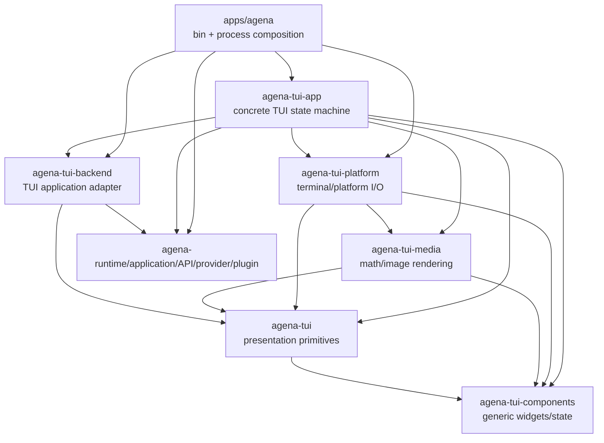

# `apps/agena` Crate 拆分执行计划

> 状态：待执行
>
> 规划日期：2026-07-24
>
> 代码基线：`a9d07dd11cf8`
>
> 事实来源：`cargo metadata --format-version 1 --locked`、`scripts/rust-architecture-report.py`、`docs/rust-workspace-analysis.md` 与针对 `apps/agena` 的模块引用聚合。
>
> 执行模式：一次连续的源码迁移列车；所有移动、路径修复、可见性修复、manifest 和文档修改完成后，才开始 Cargo check/test/lint。

## 1. 结论

本轮应新增四个真实 crate：

1. `agena-tui-media`：公式、Markdown 图片、SVG、Unicode 数学与终端图片 artifact 渲染。
2. `agena-tui-platform`：终端生命周期、终端能力探测、剪贴板、附件获取、外部编辑器/分页器、Kitty/iTerm2 传输。
3. `agena-tui-backend`：TUI 面向 `Application`/`Runtime`/provider/plugin 的后端适配器。
4. `agena-tui-app`：具体 TUI 状态机、输入分发、overlay/studio/workbench、transcript/view 与命令呈现。

完成后，`apps/agena` 只保留：

- `src/main.rs`：唯一 CLI/bin 入口与 app-server mode。
- `src/lib.rs`：进程级 tracing、Runtime bootstrap、终端进入/恢复和四个新 crate 的组合。

当前 `apps/agena` 有 179 个 `.rs` 文件、74,625 行；本方案会批量迁出 177 个文件，只留下两个入口文件。拆分不是通过 `include!`、`#[path]`、symlink、源码复制或旧路径 facade 实现，而是让 Cargo 编译四个真正独立的 library target。

`plugin_workbench` 和 `transcript_view` 暂不单独建立 crate。它们虽然分别约 11,382 行和 10,852 行，但当前分别有 26 和 13 个模块回指 `app` 根；先硬拆只会制造巨大公共面、回调壳或依赖环。它们先随完整状态机进入 `agena-tui-app`，待显式 State/Action/Effect 边界形成后再做下一轮拆分。

## 2. 不可妥协的执行约束

### 2.1 速度约束

- 全程优先使用 `git mv` 移动完整目录或一组文件，禁止逐文件重新创建并粘贴源代码。
- 四个 crate 一次建好，四组源码连续迁完，再统一修改路径、可见性和 manifest。
- 源码迁移列车中不运行 `cargo check`、`cargo test`、Clippy、E2E、依赖扫描或性能测试。
- 列车中允许且要求使用静态工具：现有分析生成器、`rg`、`git status`、`git diff --check`；这些命令不编译代码。
- 第一次编译前必须关闭全部已知编辑队列，避免用编译器一条错误一条错误地指导迁移。
- 第一次 check 产生的完整错误集按“路径、可见性、trait/type、feature、测试支持”分组，一批修完后再运行下一次 check。

### 2.2 架构约束

- 不增加 `include!`。
- 不增加跨 crate 的 `#[path = "..."]`；当前 `app_settings_choices/provider.rs` 的本地测试 `#[path]` 也在迁移时改成标准模块布局。
- 不使用 symlink、hard link、生成源码镜像或复制后保留两份 owner。
- 不创建依赖回 `apps/agena` 的 library crate。
- 不建立只为保持旧 `crate::...` 路径可编译的 compatibility module、alias crate 或 wrapper crate。
- 不允许 `agena-tui-media`、`agena-tui-platform`、`agena-tui-backend` 依赖 `agena-tui-app`。
- 不把 concrete Runtime/backend 依赖塞回 `agena-tui` 或 `agena-tui-components`；它们继续是较低层的 presentation primitives。
- 公共 API 只开放真实跨 crate 消费的 item；不能为了快速消灭 E0603 而把整个 crate 机械替换成全 `pub`。

### 2.3 行为约束

- 本轮只改变源码所有权、模块路径和 Cargo 依赖，不改变用户可见行为、CLI、keymap、终端协议、网络安全限制或持久化语义。
- 单元测试随 owner 一起移动；不能把测试留在 `apps/agena` 再通过源码包含访问私有实现。
- `apps/agena` 继续是唯一 `agena` binary package，`default-members = ["apps/agena"]` 保持不变。
- `agena_app::{TuiLaunchArgs, init_tui_tracing, run_embedded}` 的同 package library API 暂时保持，避免把进程级初始化错误地放进通用 TUI crate。

## 3. 当前结构事实

现有分析报告对 `agena::agena_app` 得到：231 个模块、230 条声明边、438 条模块引用边、0 个未解析模块。按顶层 owner 聚合如下。

| 当前 owner | 文件数 | 行数 | 主要方向 | 决策 |
| --- | ---: | ---: | --- | --- |
| `app` | 137 | 59,342 | 依赖 backend、platform、media；内部高度回指 `app` 根 | 整体迁入 `agena-tui-app` |
| `backend` | 18 | 6,636 | 只引用自身模块；被 `app` 消费 | 独立为 `agena-tui-backend` |
| `math_render` | 3 | 3,396 | 只引用自身子模块与低层 TUI primitives | 独立为 `agena-tui-media` |
| terminal/platform 组合 | 15 | 3,297 | 内部单向聚合，并依赖 media | 独立为 `agena-tui-platform` |
| `commands` | 1 | 521 | 无当前 crate 内依赖；由 app 消费 | 随 `agena-tui-app` 迁移 |
| `ui_text` | 1 | 514 | 依赖 API/domain/plugin/TUI 文案类型 | 随 `agena-tui-app` 迁移 |
| `composer_queue` | 1 | 122 | 反向引用 `ComposerDraft` | 随 `agena-tui-app` 迁移 |
| `keymap_contract_tests` | 1 | 55 | 测试 `ui_text`/keymap 合同 | 随 `agena-tui-app` 迁移 |
| crate root | 1 | 315 | 组合 app/backend/terminal/runtime | 留在 `apps/agena/src/lib.rs` |
| binary root | 1 | 427 | CLI 与 app-server mode | 留在 `apps/agena/src/main.rs` |

这里的 terminal/platform 组合包括：

- `attachment_source.rs`
- `clipboard/`
- `external_editor.rs`
- `external_pager.rs`
- `helper_runner.rs`
- `iterm2.rs`
- `kitty.rs`
- `provider_error.rs`
- `terminal/`
- `terminal_transfer.rs`

关键引用事实：

- `backend` 没有引用 `app`，因此是干净的下层边界。
- `math_render` 没有引用 `app`、`backend` 或 terminal owner；terminal 只单向依赖它。
- platform 内部存在 `attachment_source → clipboard/terminal/kitty/iterm2`、`terminal → media/kitty/iterm2/helper_runner` 等关系，把这些文件放在一个 crate 可避免人为制造多个微型 crate 和循环。
- `composer_queue → app::ComposerDraft` 是明确反向边，因此 queue 不应单独放入基础 crate。
- `app` 根被 147 条模块引用边指向。把 `app` 的子目录现在拆成多个 crate，会把大量 `pub(in crate::app)` 变成跨 crate API，并立即放大耦合面。

## 4. 目标依赖图

箭头表示“上层依赖下层”。



必须保持的拓扑顺序是：

```text
agena-tui-components
  <- agena-tui
  <- agena-tui-media
  <- agena-tui-platform
  <- agena-tui-app
  <- apps/agena

agena-runtime/application/API/provider/plugin
  <- agena-tui-backend
  <- agena-tui-app
  <- apps/agena
```

`agena-tui-backend` 与 `agena-tui-platform` 互不依赖；`agena-tui-backend` 与 `agena-tui-media` 互不依赖。这样能保持新图无环，并让 backend、media、platform 可以独立增量编译和测试。

## 5. 四个 crate 的职责与边界

### 5.1 `agena-tui-media`

职责：

- LaTeX/公式解析、布局与 PNG/Unicode fallback。
- Markdown 本地/远程图片与 SVG 的安全读取、限制、缓存和渲染。
- `ratatui-image` protocol artifact、placement 与 renderer。
- 与 terminal graphics hint、cell size、主题前景色相关的媒体配置。

不负责：

- 打开/恢复 terminal。
- 读取键盘或 terminal response。
- App 状态、transcript 选择或 UI overlay。
- Runtime、provider、session 或持久化。

移动范围：

```text
apps/agena/src/math_render.rs       -> crates/agena-tui-media/src/lib.rs
apps/agena/src/math_render/*.rs     -> crates/agena-tui-media/src/*.rs
```

生产 API 至少覆盖当前真实消费者需要的：

- 配置/context：`MathGraphicsConfig`、`MathLayoutConfig`、`MathRenderContext`。
- artifact/placement：`MathArtifact`、`MathLinePlacement`、`TranscriptMathPlacement`、`MathGraphicsRenderer`。
- context scope：`with_math_render_context`、`with_text_math_rendering`、`layout_config`。
- 渲染与状态：`render_formula`、`render_markdown_image`、`render_markdown_svg`、`unicode_formula`、`semantic_math_row_heights`、`remote_image_generation`、`formula_foreground_for_background` 及源码实际引用的其余函数。

测试专用的 `seed_remote_image`、固定 layout/context 构造器不应混进普通生产 API。建立 `test-support` feature 和 `test_support` module；`agena-tui-app` 只在 dev-dependency 中启用它。这样 app 的跨 crate 单元测试仍可构造确定性媒体环境，同时正常 build 不开放缓存注入接口。

### 5.2 `agena-tui-platform`

职责：

- `TerminalRuntime` 的进入、绘制、输入、协议事务、恢复与 panic cleanup。
- terminal capability、color、graphics/provider 探测的进程侧证据收集。
- Kitty/iTerm2 helper 探测、上传与下载。
- 系统剪贴板、OSC52、剪贴板图片与粘贴路径规范化。
- 外部编辑器、路径打开、外部分页器。
- 附件源与受限临时目录/上传树检查。

不负责：

- TUI 的 session/provider/plugin 业务动作。
- App 状态机和 view。
- 公式/图片内容布局算法；该算法由 `agena-tui-media` 负责。
- Runtime/application backend。

移动范围：

```text
apps/agena/src/attachment_source.rs -> crates/agena-tui-platform/src/attachment_source.rs
apps/agena/src/clipboard/           -> crates/agena-tui-platform/src/clipboard/
apps/agena/src/external_editor.rs   -> crates/agena-tui-platform/src/external_editor.rs
apps/agena/src/external_pager.rs    -> crates/agena-tui-platform/src/external_pager.rs
apps/agena/src/helper_runner.rs     -> crates/agena-tui-platform/src/helper_runner.rs
apps/agena/src/iterm2.rs            -> crates/agena-tui-platform/src/iterm2.rs
apps/agena/src/kitty.rs             -> crates/agena-tui-platform/src/kitty.rs
apps/agena/src/provider_error.rs    -> crates/agena-tui-platform/src/provider_error.rs
apps/agena/src/terminal/            -> crates/agena-tui-platform/src/terminal/
apps/agena/src/terminal_transfer.rs -> crates/agena-tui-platform/src/terminal_transfer.rs
```

公共面按业务模块暴露：`attachment_source`、`clipboard`、`external_editor`、`external_pager`、`iterm2`、`kitty`、`terminal`、`terminal_transfer`。`helper_runner` 和 `provider_error` 默认保持 crate-private；如果公共签名必须暴露错误类型，只在 crate root 导出该错误类型，不开放 helper 执行细节。

`terminal/mod.rs` 对 `crate::math_render::MathGraphicsConfig` 的依赖改成 `agena_tui_media::MathGraphicsConfig`。platform 不能为旧路径建立本地 `math_render` re-export module。

### 5.3 `agena-tui-backend`

职责：

- `Backend` facade 对 Application command/query 的调用。
- session 列表、消息刷新、run/permission/user-input 的 TUI 适配。
- provider selection/settings/draft auth/config 的 TUI 工作流适配。
- plugin command、permission studio、snapshot/commit/PR 与 workspace 文件查询适配。
- API/resource 与 plugin attachment 等边界值的转换。

这里的 facade 是有业务含义的 application adapter，不是为迁移保留旧模块路径的 compatibility facade。

不负责：

- 绘制 UI。
- terminal、clipboard 或 external process。
- 进程 bootstrap。
- 通用 Application/Domain 规则；若发现可复用业务规则，应下沉到已有 owner，而不是继续扩大 backend。

移动范围：

```text
apps/agena/src/backend.rs       -> crates/agena-tui-backend/src/lib.rs
apps/agena/src/backend/*.rs     -> crates/agena-tui-backend/src/*.rs
apps/agena/src/backend/**/...   -> 保持相对层级批量移动到新 crate 的 src/
```

旧 `backend.rs` 直接成为新 crate 的 `lib.rs`，旧 `backend/` 的内容整体上移一级。内部路径一次批量改为 crate root：

```text
crate::backend::X     -> crate::X
use crate::backend::{ -> use crate::{
```

对 app 实际消费的 `Backend`、backend DTO、provider draft 类型、error/result 和转换函数建立明确 root API。当前静态扫描仅 `crate::backend` 就涉及约 24 个文件、109 个路径出现，必须先生成跨边界 symbol 清单，再一次性提升所需 item；不能把所有候选 `pub(crate)` 机械提升为 `pub`。

### 5.4 `agena-tui-app`

职责：

- `App`、`LaunchOptions` 和具体 TUI 状态。
- 输入、鼠标、navigation、overlay、settings/provider/permission studio。
- session event dispatch、composer、queue、commands 与用户可见文案。
- transcript state/parser/render/view。
- plugin workbench 和具体 view tree。

不负责：

- 进程 tracing subscriber。
- Runtime bootstrap/shutdown。
- terminal ownership/restore。
- concrete platform helper 实现。
- media fetch/cache/rasterization 实现。
- Application/Runtime adapter 实现。

移动范围：

```text
apps/agena/src/app.rs                 -> crates/agena-tui-app/src/lib.rs
apps/agena/src/app/*                  -> crates/agena-tui-app/src/*
apps/agena/src/commands.rs            -> crates/agena-tui-app/src/commands.rs
apps/agena/src/composer_queue.rs      -> crates/agena-tui-app/src/composer_queue.rs
apps/agena/src/ui_text.rs             -> crates/agena-tui-app/src/ui_text.rs
apps/agena/src/keymap_contract_tests.rs -> crates/agena-tui-app/src/keymap_contract_tests.rs
```

旧 `app.rs` 直接成为 `lib.rs`，旧 `app/` 的内容整体上移一级。这样不需要一个包着原 `app` 的 wrapper module，也不需要 `#[path]`。相对的 `super::...` 多数仍自然指向新的 crate root；绝对路径按下列规则批量降一级：

```text
crate::app::X          -> crate::X
crate::app             -> crate
pub(in crate::app)     -> pub(crate)
```

`commands`、`composer_queue`、`ui_text` 仍在同一 crate，因此它们原有的内部关系不会被迫变成跨 crate API。`agena-tui-app` 对外只承诺运行组合所需的 `App` 和 `LaunchOptions`；其余状态默认保持 crate-private。

## 6. 预计 Cargo 依赖

以下列表来自现有源码观测到的 crate root；执行时先按这个集合建立 manifest，最终编译稳定后再用 `cargo machete`/metadata 清除漏报或多报。宏展开、cfg 分支和 trait 方法可能让纯 token 扫描漏掉少量依赖，因此该表是高质量起点而不是替代最终 Cargo 验证。

| 新 package | 第一方依赖 | 外部依赖 |
| --- | --- | --- |
| `agena-tui-media` | `agena-tui`, `agena-tui-components` | `base64`, `image`, `imagesize`, `pulldown-latex`, `ratatui`, `ratatui-image`, `ratex-layout`, `ratex-parser`, `ratex-render`, `ratex-types`, `regex`, `reqwest`, `resvg`, `roxmltree`, `rust-latex-parser`, `term-maths`, `tokio`, `unicode-width`, `url` |
| `agena-tui-platform` | `agena-tui`, `agena-tui-components`, `agena-tui-media` | `anyhow`, `arboard`, `base64`, `crossterm`, `image`, `libc`, `ratatui`, `shlex`, `tempfile`, `tokio`, `tracing`, `url`, `uuid` |
| `agena-tui-backend` | `agena-api`, `agena-application`, `agena-domain`, `agena-plugin-host`, `agena-plugin-sdk`, `agena-provider`, `agena-runtime`, `agena-tui` | `anyhow`, `base64`, `ignore`, `imagesize`, `mime_guess`, `serde`, `serde_json`, `tokio` |
| `agena-tui-app` | `agena-api`, `agena-application`, `agena-domain`, `agena-plugin-host`, `agena-plugin-sdk`, `agena-provider`, `agena-runtime`, `agena-tui`, `agena-tui-components`, `agena-tui-media`, `agena-tui-platform`, `agena-tui-backend` | `anyhow`, `base64`, `chrono`, `comrak`, `crossterm`, `image`, `indexmap`, `ratatui`, `regex`, `serde`, `serde_json`, `serde_yaml`, `shlex`, `syntect`, `tempfile`, `textwrap`, `tokio`, `tracing`, `tui-markdown`, `unicode-segmentation`, `unicode-width`, `url`, `uuid` |

`apps/agena` 迁移后预计只需保留源码真正直接使用的依赖：

- 第一方：`agena-api-server`、`agena-application`、`agena-cli`、`agena-domain`、`agena-provider`、`agena-runtime`、`agena-tui`、`agena-tui-app`、`agena-tui-backend`、`agena-tui-platform`。
- 外部：`anyhow`、`async-trait`、`clap`、`thiserror`、`tokio`、`tracing`、`tracing-subscriber`。

`agena-api`、plugin crates、`agena-tui-components` 和所有 media/platform 重依赖应从 `apps/agena/Cargo.toml` 的直接声明中移除；如果 `main.rs`/`lib.rs` 没有直接路径引用，就不因传递类型而保留直接依赖。

根 `Cargo.toml` 一次完成：

- 把四个新目录加入 `[workspace].members`。
- 把四个 path dependency 加入 `[workspace.dependencies]`。
- 保持 `apps/agena` 为 `default-members`。
- 每个新 crate 使用 workspace package fields 和 workspace lints。
- 不增加默认 feature 来模拟旧的整包行为；只有明确的 `test-support` 可作为非默认 feature。

## 7. 批量迁移方案

以下命令表达移动粒度；实际执行前先确认目标目录不存在且 Git 状态中的既有用户改动未被覆盖。

### 7.1 一次创建目录和 manifest

先创建四个 `src/`，然后用一个 `apply_patch` 同时写四个 `Cargo.toml`、`agena-tui-platform/src/lib.rs`、根 workspace manifest 和 `apps/agena/Cargo.toml` 的初始依赖变更。media、backend、app 的 `lib.rs` 来自原源码移动，不手写替代实现。

```bash
mkdir -p \
  crates/agena-tui-media/src \
  crates/agena-tui-platform/src \
  crates/agena-tui-backend/src \
  crates/agena-tui-app/src
```

### 7.2 dependency leaf 先移动

先移动 media，再移动 platform 和 backend；这只是保持人类认知顺序，不在中间编译。

```bash
git mv apps/agena/src/math_render/* crates/agena-tui-media/src/
git mv apps/agena/src/math_render.rs crates/agena-tui-media/src/lib.rs

git mv apps/agena/src/attachment_source.rs crates/agena-tui-platform/src/
git mv apps/agena/src/clipboard crates/agena-tui-platform/src/
git mv apps/agena/src/external_editor.rs crates/agena-tui-platform/src/
git mv apps/agena/src/external_pager.rs crates/agena-tui-platform/src/
git mv apps/agena/src/helper_runner.rs crates/agena-tui-platform/src/
git mv apps/agena/src/iterm2.rs crates/agena-tui-platform/src/
git mv apps/agena/src/kitty.rs crates/agena-tui-platform/src/
git mv apps/agena/src/provider_error.rs crates/agena-tui-platform/src/
git mv apps/agena/src/terminal crates/agena-tui-platform/src/
git mv apps/agena/src/terminal_transfer.rs crates/agena-tui-platform/src/

git mv apps/agena/src/backend/* crates/agena-tui-backend/src/
git mv apps/agena/src/backend.rs crates/agena-tui-backend/src/lib.rs
```

### 7.3 整体移动 app 状态机

```bash
git mv apps/agena/src/app/* crates/agena-tui-app/src/
git mv apps/agena/src/app.rs crates/agena-tui-app/src/lib.rs
git mv apps/agena/src/commands.rs crates/agena-tui-app/src/
git mv apps/agena/src/composer_queue.rs crates/agena-tui-app/src/
git mv apps/agena/src/ui_text.rs crates/agena-tui-app/src/
git mv apps/agena/src/keymap_contract_tests.rs crates/agena-tui-app/src/
```

对现有测试 path 做标准布局移动：

```text
crates/agena-tui-app/src/app_settings_choices/provider_tests.rs
  -> crates/agena-tui-app/src/app_settings_choices/provider/tests.rs
```

随后把：

```rust
#[path = "provider_tests.rs"]
mod tests;
```

改成标准的：

```rust
mod tests;
```

### 7.4 一次批量重写模块路径

先用 `rg -l` 固定受影响文件集，再用 AST-aware rewrite 或一个可审阅的机械 patch 完成；不要手工打开 177 个文件逐个修改。

| 旧路径 | 新路径 |
| --- | --- |
| `crate::app::...` | `crate::...`（仅新 `agena-tui-app` 内） |
| `pub(in crate::app)` | `pub(crate)`（仅新 `agena-tui-app` 内） |
| `crate::backend::...` | `crate::...`（仅新 `agena-tui-backend` 内） |
| `crate::backend...` | `agena_tui_backend...`（新 app 与 `apps/agena`） |
| `crate::math_render...` | `agena_tui_media...`（新 app/platform 与 `apps/agena`） |
| `crate::attachment_source...` | `agena_tui_platform::attachment_source...` |
| `crate::clipboard...` | `agena_tui_platform::clipboard...` |
| `crate::external_editor...` | `agena_tui_platform::external_editor...` |
| `crate::external_pager...` | `agena_tui_platform::external_pager...` |
| `crate::iterm2...` | `agena_tui_platform::iterm2...` |
| `crate::kitty...` | `agena_tui_platform::kitty...` |
| `crate::terminal...` | `agena_tui_platform::terminal...` |
| `crate::terminal_transfer...` | `agena_tui_platform::terminal_transfer...` |

`helper_runner` 和 `provider_error` 在 platform 内仍使用 `crate::...`，不跨 crate 改写。`commands`、`composer_queue`、`ui_text` 在新 app 内也仍使用 `crate::...`。

批量替换必须按“长路径优先”进行，例如先处理 `crate::app::` 再处理精确的 `crate::app`，避免生成 `crate::::` 或误改字符串。替换后立即用 `rg` 查零残留和异常 token，但仍不运行 Cargo。

### 7.5 一次完成 API 可见性

在路径重写前从消费者中生成三份 symbol inventory：

1. `agena-tui-app`/shell 对 backend 的类型、函数、方法消费。
2. app/platform/shell 对 media 的生产 API 和测试 API 消费。
3. app/shell 对 platform 的模块、类型、函数消费。

根据 inventory 一次修改定义与 crate root exports：

- 原 owner 内部仍然使用的 item 保持 private 或 `pub(crate)`。
- 真实跨 crate 生产消费提升为 `pub`。
- 测试注入能力进入 feature-gated `test_support`。
- 不建立旧路径 re-export。
- 不使用 glob public export；显式列出 root API，便于后续审计。

这一步应在第一次编译前完成。编译器只用于发现静态工具漏掉的 cfg/macro/trait 边，而不是代替 API 设计。

### 7.6 收紧 `apps/agena`

从 `apps/agena/src/lib.rs` 删除所有已迁移的 `mod` 声明，改为直接导入：

```text
agena_tui_app::{App, LaunchOptions}
agena_tui_backend::Backend
agena_tui_platform::terminal::TerminalRuntime
```

`run_embedded` 继续负责：

1. Runtime bootstrap。
2. 构造 `Backend`。
3. 解析 i18n/TUI preferences。
4. 进入 `TerminalRuntime`。
5. 构造并运行 `App`。
6. 恢复 terminal 并 shutdown Runtime。

`main.rs` 不吸收这段逻辑。它继续调用 `agena_app::run_embedded`，并继续拥有 CLI/app-server mode 的进程入口。

### 7.7 一次清理 manifest 和旧 owner

- 按第 6 节把直接依赖移动到四个新 manifest。
- 从 `apps/agena/Cargo.toml` 删除不再直接使用的 30+ 个依赖。
- 删除移动后产生的空目录；不删除任何未确认的用户文件。
- 搜索并删除只为旧模块路径服务的 import。
- 更新与 owner 相关的 TUI terminal 文档链接或源码路径。
- 暂不重生成全量分析报告，直到源码/manifest 编辑队列完全关闭。

## 8. 源码迁移列车中的静态闭环

这一节全部在 Cargo gate 之前执行。

### 8.1 文件所有权检查

期望：

```text
apps/agena/src/lib.rs
apps/agena/src/main.rs
```

检查：

```bash
rg --files apps/agena/src
find crates/agena-tui-{app,backend,media,platform} -type l
git status --short
```

验收：

- `apps/agena/src` 没有第三个 Rust 文件。
- 新 crate 没有 symlink。
- Git 能把绝大多数变化识别为 rename，而不是 177 组无关 delete/add。

### 8.2 禁止源码桥

```bash
rg -n '\binclude!\s*\(|#\[path\s*=' \
  apps/agena crates/agena-tui-{app,backend,media,platform}
```

期望 0 个结果。`include_str!`/`include_bytes!` 若用于真实静态资源不属于源码桥，但本轮不得用它们包含 `.rs` 文件。

### 8.3 旧绝对路径归零

分别检查：

```text
新 app 中不存在 crate::app、crate::backend、crate::math_render、
crate::attachment_source、crate::clipboard、crate::external_editor、
crate::external_pager、crate::iterm2、crate::kitty、crate::terminal、
crate::terminal_transfer。

新 backend 中不存在 crate::backend。
platform 中不存在 crate::math_render。
```

同时搜索异常替换结果：`crate::::`、`agena_tui_*::::`、重复 import 和仍指向 `apps/agena/src/{app,backend,math_render}` 的文档路径。

### 8.4 依赖方向静态审计

在 Cargo metadata 前先直接检查 manifest 文本：

- media 不声明 platform/backend/app/runtime/application/provider/plugin。
- platform 不声明 backend/app/runtime/application/provider/plugin。
- backend 不声明 platform/media/app。
- app 可以依赖 backend/platform/media，但三者不能反向依赖 app。
- 四个新 crate 都不能依赖 `apps/agena` 的 path。

### 8.5 Patch hygiene

- `git diff --check`。
- 对新增且尚未跟踪的 manifest/doc 使用等价的 no-index whitespace 检查。
- `git diff --stat` 核对移动规模。
- `git diff --find-renames --summary` 核对 rename 识别。
- 检查没有顺手格式化无关 workspace 文件；统一格式化留到最终 gate。

只有上述静态检查完成、源码/manifest/doc 待编辑列表为空，才宣布 source train closed。

## 9. 最终 stabilization gate

本节只能在 source train closed 后开始。

### 9.1 格式与 lockfile

1. 运行 `cargo fmt --all`，一次格式化所有移动和路径变更。
2. 运行一次非 `--locked` 的 `cargo metadata --format-version 1`，让 Cargo 为四个新本地 package 更新 `Cargo.lock`。
3. 审查 lockfile diff；只接受新 workspace package stanza 和因直接依赖重新归属产生的本地 dependency-array 变化，不接受无关第三方版本漂移。
4. 运行 `cargo metadata --format-version 1 --locked`，确认 workspace/lock 一致。

### 9.2 第一次编译与整批修复

先运行最短但覆盖最终消费链的：

```bash
cargo check -p agena --all-targets --locked
```

把全部诊断收集完整，然后按类别整批修复：

- E0432/E0433：路径或遗漏依赖。
- E0603/E0624：公共 API/方法可见性。
- E0308/E0277：跨 crate 后暴露的真实 type/trait 边界。
- cfg/feature：测试支持或平台 feature。
- unused import/dead export：机械移动遗留。

修完完整批次后再重跑相同命令。不要每修一个文件就 check。

### 9.3 新 owner 的单元测试

先编译并运行发生所有权变化的测试：

```bash
cargo test \
  -p agena-tui-media \
  -p agena-tui-platform \
  -p agena-tui-backend \
  -p agena-tui-app \
  -p agena \
  --locked
```

这些测试必须是随源文件真实移动后的测试；不得从旧 app 路径 include。

### 9.4 Workspace 全门禁

局部链稳定后只做一次完整门禁：

```bash
cargo fmt --all -- --check
cargo check --workspace --all-targets --locked
cargo clippy --workspace --all-targets --all-features --locked -- -D warnings
cargo test --workspace --locked
cargo test -p agena-e2e --locked
cargo machete
cargo deny check
git diff --check
```

如果仓库当前 CI feature matrix 另有命令，紧接在该批次执行，不插回源码移动阶段。

### 9.5 重新生成架构报告

全部 Cargo gate 通过后运行：

```bash
python3 scripts/rust-architecture-report.py \
  --output docs/rust-workspace-analysis.md
```

新报告必须证明：

- workspace package 从 37 增加到 41。
- `agena` package 只剩 2 个 Rust 文件。
- 四个新 crate 的所有文件都被 target 模块树触达。
- 模块解析未找到/歧义项仍为 0。
- 第一方 normal dependency graph 仍无环。
- 新图满足第 4 节方向，尤其没有 platform/backend/media → app 的反向边。

## 10. 分阶段验收标准

### 10.1 Source train closed

- [ ] 四个 manifest 和四个真正的 lib target 已存在。
- [ ] 177 个源文件通过批量 move 到达新 owner。
- [ ] `apps/agena/src` 只剩 `main.rs`、`lib.rs`。
- [ ] 没有源码复制、symlink、`include!` 或 `#[path]`。
- [ ] 没有旧模块绝对路径残留。
- [ ] 跨 crate 公共 API inventory 已显式落实。
- [ ] `apps/agena/Cargo.toml` 的重依赖已迁到 owner。
- [ ] 所有 source/manifest/doc 编辑完成。

### 10.2 Functional stabilization complete

- [ ] locked metadata 可解析且 lockfile 无无关版本漂移。
- [ ] `agena` all-target check 通过。
- [ ] 五个相关 package 的测试通过。
- [ ] workspace check、strict Clippy、workspace tests、E2E 通过。
- [ ] dependency analyzers 和 diff hygiene 通过。
- [ ] 全量架构报告已重生成且新依赖图无环。

### 10.3 架构结果

- [ ] process composition 只在 `apps/agena`。
- [ ] concrete TUI state machine 只在 `agena-tui-app`。
- [ ] TUI backend adapter 只在 `agena-tui-backend`。
- [ ] terminal/platform I/O 只在 `agena-tui-platform`。
- [ ] math/image rendering 只在 `agena-tui-media`。
- [ ] `agena-tui`/`agena-tui-components` 未吸收 concrete Runtime 或 process owner。
- [ ] 没有为迁移保留的旧路径 facade。

## 11. 本轮明确不做的进一步拆分

### 11.1 `agena-tui-transcript`

当前 `transcript_view` 为 12 个文件、约 10,852 行；`transcript_state` 另有约 1,728 行。它们依赖 App 内部的 message resource、selection、theme、math placement、backend refresh 与 view helper。现在拆 crate 会要求一个过宽的 App context 或把 App 类型下沉，收益不足。

下一轮只有同时满足以下条件才拆：

- transcript 输入可表示为独立 `TranscriptModel`/resource，而不是借用 `App`。
- renderer 不调用 backend/platform effect。
- navigation/selection 通过明确 action 返回给 App。
- media 依赖保持单向。
- 新 crate 不需要 `agena-tui-app` 依赖。

### 11.2 `agena-tui-plugin-workbench`

当前为 26 个文件、约 11,382 行，所有 26 个模块都直接或间接回指 app 根。它同时读取 backend schema/config、App overlay、editor/list state 和 i18n helper。当前单独建 crate 极可能成为“把 `&mut App` 传进去”的假拆分。

下一轮应先在 `agena-tui-app` 内形成：

```text
PluginWorkbenchState
PluginWorkbenchAction
PluginWorkbenchEffectRequest
PluginWorkbenchViewModel
```

只有 reducer/view 能以这些值工作，effect 由 App/backend 边界执行后，才迁出真实 crate。

### 11.3 provider/settings/permission studio 微型 crate

这些模块目前与 App overlay、choice、backend draft DTO 共享大量私有状态。它们应作为未来 State/Action/Effect vertical slice 处理，不在本轮为目录对称性建立多个 1–3 千行、却依赖面巨大的 crate。

## 12. 实施顺序摘要

最终执行顺序固定为：

1. 记录并保护当前 dirty worktree。
2. 用现有报告/脚本冻结 move map、依赖清单、公共 symbol inventory。
3. 一次建立四个 crate manifest 和 workspace entries。
4. 目录级移动 media。
5. 目录级移动 platform。
6. 目录级移动 backend。
7. 目录级移动完整 app 状态机及其 commands/text/queue/tests。
8. 一次完成路径降级和跨 crate import 重写。
9. 一次完成公共 API、`test-support` 和 `apps/agena` 组合入口。
10. 一次完成 manifest 收紧、旧 owner 清理、静态闭环和文档更新。
11. 宣布 source train closed。
12. 最后运行 format、metadata、check、test、Clippy、E2E、dependency gates。
13. 重新生成全量架构报告，以报告数据而不是目录观感确认拆分完成。

这条顺序优先减少人工写文件和重复编译：源码可以在步骤 4–10 期间暂时不可编译，但不允许用兼容桥掩盖；真正的 crate 边界、consumer 修复和旧 owner 删除必须在同一列车里一次完成。
