# Part、内容资源与实时呈现重构

日期：2026-10-08。调研基线：`e3e51b62`。本文记录当前重构的目标契约、实施顺序和验收证据；实施状态必须依据代码和实际验证更新。

## 1. 目标与明确决定

彻底重构 Part 的运行、内容承载、持久化、同步和消费链路。保留有价值的领域语义，直接替换旧实现，不维护历史 API、旧数据形状、旧工具流事件或两套生产写入路径。

- Agena Server 完全不感知 Web/TUI 客户端种类。领域数据、数据库、查询、订阅、投影、缓存均为通用结构。
- 所有客户端消费同一套 Part、内容资源、语义文档与游标协议；视觉模型、折叠、主题、滚动和交互属于客户端。
- 流式内容实时可见；热路径不能逐 chunk 读写数据库、加载完整 Session 或复制完整历史。
- 大量内容使用有界内存、分段持久化和范围读取；不能周期性重写不断增长的完整 JSON。
- 稳定的 Part、block 和 resource 身份贯穿运行、暂停、完成和历史回看。
- Web 与 TUI 均在工具 Part 展开区域呈现高质量实时日志或终端屏幕。
- 正确处理最终输出、重复、缺口、取消、重试、重启、fork、后台进程和慢订阅者。
- 本次不自动删除开发者或用户的数据库。代码只支持当前 schema；不为旧 schema 保留迁移链或兼容实现。验证使用独立新数据库。

本计划替代此前讨论中“旧接口兼容适配”的建议。当前仓库的无历史兼容原则见 [当前数据契约](current-data-contract.md)。

## 2. 调研基线中的问题

以下描述基线实现的问题；重构后的实际状态见第 10–13 节。

1. `agena-api::live::PartResource`、`agena-api::part::PartResource`、`SessionTranscriptPart` 并存，身份、kind、生命周期表达不完全一致。
2. 工具流消费路径主要处理 `text_delta`，维护 `metadata.live_output` 尾部；每次更新通过完整 Session 加载和 Part 覆盖。
3. 流式通知复制完整 Part；缓存 Session 的读取仍查询数据库位置。现有缓冲避免了每 token 直接落盘，但不能消除这些复制、读取和投影成本。
4. 运行中 shell 输出被转成 Markdown 代码块；stdout/stderr、部分行、ANSI、屏幕状态和结构化进度没有贯穿协议。
5. transcript 查询含服务端默认可见数、fold 和同角色显示分组；返回少量内容时仍可能读取选中 run 的全部 Part。
6. application 与 api-server 分别组装工具 presentation；不同读取入口可能表现不一致。
7. live feed 全局接收、投影后再做部分 scope 过滤；相同资源被按连接重复解释。
8. 共享 runtime/application 存在 TUI theme、graphics 和默认展开偏好类型。
9. 客户端仍有完整 transcript 克隆、大范围缓存失效和重复详情读取。
10. 流最终结果与中间 chunk 使用不同通道，必须定义收尾屏障，避免最终结果抢先导致最后输出丢失。

源代码入口：`agena-storage/src/store/{types,facade}.rs`、`agena-runtime-session/src/session/manager/replies/replies_execution.rs`、`agena-runtime-tools/src/tool/{shell,tool_registry}.rs`、`agena-api-server/src/{live,revisions}.rs`、`agena-api-server/src/rest/transcript.rs`、两端 transcript 与工具渲染模块。

## 3. 目标职责

| 概念 | 职责 | 存储与归属 |
| --- | --- | --- |
| Part | 稳定身份、调用事实、归属、生命周期、控制状态、结果引用 | 一套持久化领域事实 |
| ActivePart | 正在运行的 Part 的变更归并、当前快照、待提交边界 | 运行时唯一变更归属 |
| ContentResource | 文本、日志、结构化数据、媒体、终端输出；读取、追加、补读 | 通用资源；有界内存与分段持久化 |
| PartDocument | 内容语义、稳定 block、资源引用 | 派生结果；通用缓存，不成为第二份事实源 |
| PartViewModel | 卡片、折叠、布局、主题、选择、滚动、渲染缓存 | 客户端本地 |

服务端可以描述 Markdown、Code、Table、Diff、Command、SearchResults、MediaRef、OutputRef。不能规定 Vue 组件、TUI widget、卡片高度、显示行数、展开偏好或主题。

PTY rows/cols、cursor、modes 和字符属性是实际终端语义。观察者窗口宽度和卡片高度是客户端视图状态；观察者不自动 resize 真实 PTY。

模型投影与人类语义文档对应不同使用目的；所有人类客户端仍使用同一契约。

## 4. Part 领域与公共契约

保留稳定 `part_id`、`run_id`、`parent_part_id`、`origin_session_id`、session membership、当前有序历史和 origin-only mutation。fork 共享历史事实与资源引用。

统一一个公共 Part envelope。列表、详情、实时更新和重连采用相同字段、kind 与生命周期；通过明确的 section 请求控制负载大小，不另建客户端 DTO。

- `revision` 只表示已提交事实版本。
- `ContentResource.cursor` 表示活跃内容位置，由 epoch 和单调 sequence 组成；`committed_cursor` 表示已提交位置。Part revision 与资源游标独立，Part 不逐 token 保存游标。
- 响应明确列出包含的 sections 与对应版本；未加载、已失效、null 和空值不能混为一谈。
- lifecycle 有唯一变更入口；工具特有退出码、失败原因、等待输入等是独立领域事实，不能让两套同义状态独立变化。
- 通用 metadata 只承载真实调用/协议上下文，禁止用它装流式展示缓存。
- 纯文本与工具最终结果只有一份事实源。大正文可作为资源，Part 保存引用；模型投影按需读取，不持久化人类/模型副本。

删除旧 message/activity taxonomy、重复 Part DTO、`metadata.live_output` 及其特殊 renderer。所有仓库调用方同步改成当前契约。

## 5. 运行与事件

高频路径：producer → 对应 owner → 内存增量与游标 → 通用订阅 → 独立持久化。

初始化可读取必要 Part；运行期间增量不读取 Session、不查询 SQLite 位置、不重建历史。一个 Part 与一个内容资源分别有明确变更归属。实现可按 run/shard 管理，不要求每 Part 创建独立系统线程。

统一工具执行形式：`execute(context, event_sink) -> ToolOutcome`。非流式工具发送零个中间事件并正常返回；无需第二套生命周期。

事件使用带类型的语义操作：

- 文本追加；日志追加并保留通道；资源创建/引用。
- block insert/append/replace/remove，必须有稳定 block ID，明确可追加类型。
- 结构化 progress，包括 phase、完成量、总量、单位。
- 表格行、搜索项、Diff 等结构化内容更新。
- 权限、用户输入、执行开始/结束是可靠控制事件。

LLM 工具参数片段与已解析调用参数分开；未验证的片段不启动工具。

重试/重启建立新 epoch，延迟的旧事件不能覆盖新执行。完成后的 Part 不因后台进程继续输出而回到运行态。

## 6. 内容资源与存储

整合现有 managed output、process archive 和 terminal state，不增加面向某个客户端的内容副本。

内容资源提供稳定 opaque ID、kind/format、owner、当前 cursor、已提交 cursor、保留范围、完整性和结束状态。公共读取通过权限检查后的资源 API，不要求远端客户端读取服务端本地路径。

持久化分别承载：Part 小型事实；资源清单；分段内容。高频日志更新不改写启动 Part；内容 writer 以时间/字节阈值批量写入。禁止每事件一行 SQL 或周期性覆盖完整增长正文。

创建、授权、用户输入决定、完成、取消按语义边界提交。正文 checkpoint 由独立时间与字节预算控制；实时发送不等待正文落盘。发布 durable completion 前确认引用内容的提交范围。

资源保留策略有界，缺口和错误显式表达。process success 与 capture completeness 分开。慢客户端通过补读恢复，不反压 pipe drain；存储压力按资源策略处理，不默默伪造完整输出。

资源 GC 遵循 Part/fork 引用和活动 owner，不以单个原始 session 的删除作为唯一依据。

## 7. 同步、查询与传输

通用服务：`ReadParts(session, window, sections)`、`ReadResource(id, representation, range/cursor)`、`WatchResources(interests, cursors)`。

订阅兴趣只描述资源、范围与字段，不接收客户端种类、expanded、theme 或 viewport。

- 快照与订阅以游标屏障交接，防止查询/订阅间隙漏数据。
- 增量携带 from/to cursor；重复可忽略、缺口可定位、代际可判断。
- 内容资源的 checkpoint/completion 声明覆盖的 cursor；确认旧增量不清掉更新尾部。
- 每个资源局部恢复，不默认整 Session reload。
- durable revision 未变不能证明没有 live 更新；条件读取包括活跃位置。
- scope/权限过滤在投影和序列化前完成；共享资源投影按事实版本与 projector version 缓存。
- 订阅队列与 replay ring 有界，资源缺口需明确通知与补读。
- REST/WS/SSE/IPC 使用同一应用服务，只有传输封装不同。

当前服务端 fold 查询替换为 RunSummary 与 PartWindow：索引化计数、范围、尾部 N 条、前后游标。分页按消息计数：同角色的连续 run 属于同一条消息，页面始终结束在角色边界，因此一页不会只剩一条回复的其中一轮。客户端拥有折叠和相邻 run 的视觉分组策略。不能为返回一小段内容读取所有 run Part，也不能要求客户端下载完整历史才能折叠。

## 8. 日志与终端

PipeLog 保留采集顺序、stdout/stderr、时间、完整空白、部分行、跨读取字符、CR 更新和可补读范围。分开的管道只承诺实际采集顺序。

PTY 提供通用 TerminalSnapshot/TerminalPatch：真实尺寸、cells/runs、标准字符属性、光标和 modes。原始记录与屏幕派生表示来自同一个资源。TUI 在 widget 内绘制，不直接向外层终端写工具 escape sequences。

展开默认 read-only observation。输入、signal、真实 resize 是明确控制命令；多个观察者不会抢夺实际 PTY 尺寸。

收尾顺序：观察执行结束 → drain 输出 → 确定 final cursor 与提交位置 → 提交 ToolOutcome → 发布 completion。最终消息不能提前关闭内容资源而漏掉队列末尾。

后台启动 Part、process lifecycle、output resource 独立：启动成功的 Part 可以 completed，进程与输出仍然继续。

## 9. Web 与 TUI 视觉要求

两端消费同一 PartDocument/ContentResource，在各自范围实现：

- 稳定的命令/目录/状态头部；输出区域由执行开始到结束保持同一个 block/resource。
- 等宽日志、可读通道与标准 ANSI 样式；不以不断重建 Markdown 的方式呈现日志。
- 默认跟随尾部，向上滚动或选择时保持位置，提示新输出并可恢复跟随。
- 完成只更新状态、exit code、duration，保留输出和滚动位置。
- 大日志虚拟化/有界绘制，旧内容按需读取；搜索、复制、选择保留精确空白。
- 错误在原位置呈现，能够查看末尾相关输出。
- PTY 屏幕在 Part 内显示，支持明确取得交互控制。
- 客户端 frame scheduler 合并更新，只失效变动 Part/block；不逐增量克隆整个 transcript。
- Markdown 已稳定的部分复用解析/布局，活跃尾部按本地预算更新。
- 折叠、主题、高度、快捷键、graphics、scroll/follow 等只存在于客户端。共享 runtime/application 中的 TUI preference 解释迁走。

## 10. 重构后的实际运作

### 10.1 数据流与代码归属

```mermaid
flowchart TD
  Producer[模型 / 工具 / pipe / PTY] --> Owner[运行时执行 owner]
  Owner --> Facts[Part 身份、调用和生命周期]
  Owner --> Writer[ContentWriter]
  Facts --> SQL[(SQLite Part 与会话事实)]
  Writer --> Hub[ContentHub：游标、增量、有界 replay]
  Hub --> Delivery[统一应用服务：授权、范围读取、订阅交接]
  Hub --> Flush[独立批量提交]
  Flush --> Files[(资源 manifest 与 segment 文件)]
  Files --> Delivery
  Facts --> Projection[PartDocument 语义投影缓存]
  Projection --> API[REST / SSE / WS / IPC / RPC]
  Delivery --> API
  API --> Client[客户端资源 reducer 与本地视图]
```



所有 API 只承载通用事实和内容语义。服务端不存在“Web 输出”“TUI 输出”、按客户端区分的资源副本、数据库列、语义文档或缓存 key。上述 Client 之后才进入各自的 widget/组件、主题和交互系统。

| 层 | 当前入口 | 核心职责 |
| --- | --- | --- |
| 通用领域 | `crates/agena-domain/src/content.rs`、`content/document.rs`、`activity_view.rs` | cursor、resource、record、文档操作、终端字符与模式 |
| 公共 Part | `crates/agena-api/src/part.rs`、`live.rs`、`content.rs` | 同一 Part envelope、sections/revision、资源读取请求 |
| 活跃内容与归档抽象 | `crates/agena-storage/src/content.rs`、`content/text.rs` | 写入权、内存预算、replay、独立提交、资源内续读 |
| 持久内容 | `crates/agena-storage-sqlite/src/content_backend.rs`、`database_content.rs` | 数据库身份绑定的通用文件归档、manifest、配额与恢复 |
| 模型生产 | `crates/agena-runtime-session/src/session/processor/parts.rs`、`tool_calls.rs` | 模型正文/思考、provider 工具稳定身份和资源收尾 |
| 工具生产 | `crates/agena-runtime-session/src/session/manager/replies/replies_execution.rs`、runtime-tools 的 shell/monitor/terminal 模块 | 单一执行结果与中间事件、pipe drain、后台源、PTY |
| 大型非流式结果 | `crates/agena-runtime-session/src/session/content_result.rs` | JSON pointer + ContentRef，保留小控制事实 |
| 应用服务 | `crates/agena-application/src/application_content.rs`、`application_parts.rs`、`application_tools.rs` | 通用授权、投影、分页、快照/订阅屏障 |
| 传输 | `crates/agena-api-server/src/rest/content.rs`、`ws.rs`、`ipc.rs`、`live.rs`；`apps/agena/src/launch/rpc_server/backend.rs` | 将同一服务封装成不同传输 |
| Web | `packages/agena-web/src/lib/content*.ts`、`components/chat/AgenaContent*.vue` | 共享连接、帧归并、Xterm、Markdown/code/diff、选择和跟随 |
| TUI | `crates/agena-tui-transcript/src/content.rs`、`crates/agena-tui-app/src/app_session_events/content_reads.rs` | 增量 reducer、VT 观察、逻辑行复制、局部失效与补读 |

ActivePart 是运行时变更归属的职责描述。实现使用执行/turn accumulator、稳定 Part 和资源 writer，不要求增加一个同名持久对象或每 Part 一个独立系统线程。

### 10.2 一次工具执行

1. 创建并提交稳定 Part，保存真实 invocation 与执行状态。需要内容时打开通用资源，并在 Part 上提交引用。客户端首次加载这个 Part 时就获得稳定的 command/output block 身份。
2. producer 把 `ContentInput` 交给 writer。资源准入与合法性检查完成后，内容在内存中取得顺序 cursor 和采集时间，立即唤醒观察者；不等待文件 checkpoint，不加载 Session，不逐 chunk 更新 Part。
3. 输出服务先订阅变化，再完成资源引用/会话 membership 授权。后续授权撤销由低频 membership 变化传播；不为每条输出重新查询数据库。传输端持有游标并读取有界页面，健康输出默认以约 16 ms 合并。
4. Web/TUI 资源 reducer 检查 epoch、顺序、重复与 dependency cursor，只把变化送到对应内容区域。客户端 frame scheduler 合并绘制。打开两个组件观察同一资源时，Web 共享一个 reducer 与连接。
5. 独立 flush task 按时间/字节预算提交 pending batch。文件内容先 sync，manifest 再发布；失败重试使用最后已发布长度恢复，避免重复或部分尾部伪装成提交成功。
6. 成功收尾先关闭输出入口、排空已接收 records，再确定最终 cursor 和 capture 状态、提交尾部，最后提交 Part 的 ToolOutcome。终止与失败不能被无人读取的订阅队列永久阻塞。
7. 结束后的 Part、output block 与资源保持身份。UI 更新完成/退出信息，保留输出、展开与观察位置。后台 launch Part 完成后，后台进程和资源仍可独立存活。

“进程成功”和“输出捕获完整”是两个事实。存储耗尽、丢弃或永久失败时，资源以 Interrupted、capture_error、dropped_bytes、retained_ranges/gap 表达真实情况，不能输出一个假完整的成功日志。

### 10.3 流式、非流式与 provider 工具

| 来源 | Part 中保留 | 通用内容资源中保留 |
| --- | --- | --- |
| 模型正文/思考 | 身份、可见性、生命周期、资源引用、必要 replay 协议事实 | token 追加形成的原文 |
| shell.exec / spawn / watch | command、workdir、真实调用、退出/后台身份、输出引用 | stdout/stderr 日志与采集顺序 |
| shell.open / PTY | terminal/process 身份、明确控制结果、资源引用 | 实际 rows/cols、snapshot、row patch、cursor/modes/标准字符属性 |
| monitor.start | WebSocket 输入、monitor 身份、生命周期、资源引用 | 采集输出；不保留历史 command monitor 入口 |
| 结构化流工具 | invocation、状态、资源引用 | bounded document checkpoint 和 typed mutations |
| 小型非流式工具 | 同一个 RawOutput 中的小结果事实 | 不必创建无用 stream；需要时才外置 |
| 大型非流式工具 | 小控制事实、ContentField(pointer/resource/format) | 大 text、diff、JSON、表格等结果正文 |
| provider 自带工具 | provider-only 语义、调用 ID、稳定执行身份、结果/诊断引用 | 大结果与完成时一次归档的 provider trace |

provider 报告“开始”意味着工具已在外部执行，必须即时创建正 ID 的持久 Part；不能等 completion 才把临时负 ID 改成事实。本地函数参数碎片还未通过校验时留在 accumulator，校验完成后才创建可执行调用。provider 后续异常或未给 completion 时，已经创建的调用必须 terminalize：开始时 Part 为 InProgress、工具 outcome 为 Running；异常时 Part 状态、工具 outcome、错误和结束区间同步提交，不能留下永远运行或内部仍 Pending 的调用。

provider trace 不再放进大 metadata，也不逐 start/progress 重写。完成时归档一次，Part 只存 typed ref；诊断原文不会自动混入普通工具正文或模型的 streamed_content。诊断捕获失败保留明确错误，不把成功 hosted operation 改成失败。opaque provider continuation 是必要协议事实，保留在 run/provider_state，不能当视觉缓存删除。

大型结果默认单字段 32 KiB、inline 合计 64 KiB、最多 32 个外置字段。大量小字段会使 envelope 超预算时，将整个根 payload 外置，避免几千个小字段或引用撑大 Part。读取按 JSON pointer 临时还原模型投影；不把还原正文回写原始事实。模型也可显式调用 `content.read`，用 `ContentTextPosition(after, offset)` 在单条 record 内续读，保留 UTF-8 边界、通道和缺失提示。

### 10.4 预算、保留和恢复

这些都是 source/resource 预算，与客户端类型无关。默认值可通过同一配置对象调整；它们是当前工程选择，不是所有部署的固定容量承诺。

| 范围 | 当前默认预算/策略 |
| --- | --- |
| 活跃源 | 最多 128 个 |
| 活跃 replay/pending 共享 accounting | 128 MiB |
| 单源 replay / pending | 1 MiB / 512 KiB |
| 普通记录 | 64 KiB 分块；记录开销也计入预算 |
| 批量提交 | 64 KiB 触发；500 ms 时间触发；语义收尾强制提交 |
| 文件 segment | 1 MiB；默认保留 startup 与近期 segment，最多 16 个 |
| 单资源归档 / 全局归档 | 64 MiB / 1 GiB；受 checkpoint 与实际文件占用约束 |
| 语义文档 | 64 KiB、最多 128 blocks；依赖链有源端 checkpoint |
| PTY 原子 frame | 最多 40,000 cells、16 MiB 原子预算；普通 pipe 记录仍小 |
| 范围读取 | 字节和 record 数双重有界；text page 最多 32 records，支持 record 内 offset |
| Part 查询 | ids 最多 256；Part window 最多 256，run window 最多 32 条消息（同角色的连续 run 属于同一条消息，页面不切开一条消息），按 run 取尾部有独立预算 |
| Web 日志观察 | Xterm 5000 行；资源 reducer 与 pending frame 独立有界 |
| TUI 日志观察 | 本地保留窗口明确标识 windowed；不把本地省略误报为 source gap |
| Markdown 解析 | 共享 worker、稳定 block 复用；单次解析 250 ms 预算，超时终止 worker 并保留原文显示，后续 Part 可继续解析 |

增加观察者只增加读取与传输/绘制，不创建第二个 writer、不重复持久化源内容。慢观察者不会反压子进程 pipe drain；资源配额不足会按 capture 策略记录损失。默认有限保留不是“所有日志永远完整保存”：保留范围之外需要明确呈现 gap。

重启只恢复已发布的内容范围，并将未正常收尾的资源标记 Interrupted；内存尾部不冒充持久内容。旧 epoch/未来 cursor 不能覆盖当前资源。document/terminal 缺 dependency 时回读可重建 checkpoint，恢复期间保留可用画面。最后一个 writer 意外丢弃也进入收尾；永久存储失败释放活跃源和内存，不进行无上限重试。

GC 保护所有 Part/fork 引用和活跃 writer。导入/导出携带资源 archive 并重映射 ContentRef、ContentField、provider trace 引用；不能把一个本机文件路径当远端内容契约。

订阅 session scope 是明确 session membership，不隐式等于整个 descendant tree。观察多个子会话由调用方显式订阅相应 session/resource；不同 transport 使用同一语义，不能某一路自动扩大范围。

### 10.5 两端呈现

Web 的展开区域保留稳定命令头与 output 区域，日志直接使用 Xterm。ANSI indexed colors 由客户端映射到浅/深主题，RGB 属性保留真实颜色；OKLCH 主题色通过浏览器色彩引擎解析成 Xterm 可读的 RGB。PTY 观察采用实际几何，6 行屏幕只需要相应观察高度；客户端窗口大小不会自动 resize 真实 PTY。

Web 向上滚动、终端选择和正文选择会冻结当前观察，显示新输出数量与“跟随”入口。恢复时先持有写入 guard，再 reset/replay，防止 selection 回调重入造成重复输出。完成保留同一个 Xterm DOM 和 Part 展开状态。代码块的用户展开/收起跨内容变化保留；Markdown 稳定 prefix 的 DOM 复用。复杂 Markdown 超预算先显示完整原文，不让一个 Part 长时间占用整个解析队列。

TUI 在 Part 内绘制自己的 cells/lines，不把工具 escape sequence 直接写到宿主终端。pipe 使用 VT 语义解释 ANSI、CR、分段 Unicode、stderr 和空行；PTY 使用实际 snapshot/patch。选择/复制基于逻辑行，保留缩进与空白，不把代码/表格边框当正文。资源变化只使相关 Part 缓存失效；大状态对象在高频 AppMessage 中间接持有，避免每个队列项携带数 KiB 的 enum 空间。

服务端不保存折叠、theme、graphics、follow、selection、viewport 或观察卡片高度。通用配置服务只传递不解释的客户端偏好 JSON；客户端自行读取并解释本地偏好。

## 11. 实施状态

状态依据当前代码与明确范围的验证。最后的 provider 状态一致性补强后，主门禁与插件特性/发布配置检查已通过；依赖审计的既有问题单独记录。

- [x] A：单一公共 Part envelope、sections/revision、通用 ContentRef/document/terminal 契约。
- [x] B：ContentHub/Writer、预算、批量文件归档、游标/offset 读取、局部恢复、故障收尾与 GC。
- [x] C：shell 全链路接入资源，Web/TUI 展开区域消费统一输出。
- [x] D：模型正文/思考、插件、结构化流、非流式结果、provider 自带工具统一接入。
- [x] E：通用 Part/Run 分页、语义投影缓存、REST/SSE/WS/IPC/RPC 内容服务。
- [x] F：PTY snapshot/patch、后台源生命周期、真实交互控制、客户端偏好职责。
- [x] G：Web 浏览器与 TUI 生产 renderer frame 验证，选择/跟随、精确复制、ANSI/Unicode/CR、完成稳定性。
- [x] H：完成全仓 Rust tests/clippy/fmt、Web tests/build、插件特性/发布配置及性能/视觉验证；依赖 audit 的现有失败与未测范围已明确记录。

已删除旧 transcript fold 服务端接口与重复 DTO、`metadata.live_output`、独立 process archive、自动 prompt spill、没有实际消费者的 RPC broadcaster、历史 shell.run/monitor command 兼容、snapshot 工具兼容分支。当前 shell 身份的协议拼写规范化仍属于同一当前工具契约，不是旧工具名兼容。

不保留永久 feature flag、历史 adapter、dual write 或旧输出特殊识别。未提交工作区保留，不自动删除用户数据库或提交更改。

## 12. 验证与实测证据

### 12.1 实时与持久化测量

测试使用隔离新数据库/临时资源目录。以下结果各自覆盖不同范围，p95 不能相加或互相替代。

| 测量范围 | 观察者 | records / samples | p50 | p95 | 最大值 |
| --- | ---: | ---: | ---: | ---: | ---: |
| writer admission → ContentHub observer，真实 SQLite facade + 文件归档 | 1 | 1000 / 1000 | 0.072 ms | 0.103 ms | 0.268 ms |
| 同上 | 8 | 1000 / 8000 | 0.155 ms | 0.361 ms | 0.753 ms |
| writer admission → 通用 application → 生产 loopback SSE → Rust client | 1 | 100 / 100 | 10.18 ms | 17.82 ms | 30.91 ms |
| 同上 | 8 | 100 / 800 | 9.27 ms | 17.36 ms | 18.86 ms |
| 受控 SSE → 生产 Vue/reducer/Xterm → 两次 animation frame | 1 | 40 / 40 | 41 ms | 49 ms | 49 ms |

ContentHub 探针每条记录约 1 KiB。建立 Part/资源引用、初始化 backend 后重置 SQL counter，流追加、观察者读取和资源 finalize 的 SQL 数为 **0**。1/8 观察者都准确提交 **1000 records、29 次 backend batch commit**，accounted live peak 都是 **1,047,744 bytes**，final cursor 等于 committed cursor，各观察者无缺口读到全部记录。

29 是实际成功 backend commit 调用数，含本次流期间的描述符/收尾提交，不是 OS write/fsync 系统调用数。最后保留的 2 个 segment 文件是保留结果，不能当作总写次数。accounting peak 是 replay/pending 记账值，不是进程 RSS。SQL 的 0 不包括初始创建/授权和 Part 生命周期提交，也不能说整个 agent run 不访问数据库。

可复现命令：

```sh
AGENA_STATE_DIR=/private/tmp/agena-part-tests-state cargo run --locked -p agena-storage-sqlite --example content_stream_probe
AGENA_STATE_DIR=/private/tmp/agena-part-tests-state cargo run --locked -p agena-api-server --example content_delivery_probe
```

日志：`/tmp/agena-part-source-performance-counted.log`、`/tmp/agena-part-delivery-performance.log`。浏览器指标：`/tmp/agena-part-visual/part-streaming-browser.json`。

### 12.2 视觉与交互

实际 WebKit 运行生产 Vue、OperationPart、Markdown/CodeBlock、Xterm 和资源 reducer；测试 fetch/SSE 用于控制输入。验证 ANSI、CR、中文/emoji、stdout/stderr、精确空白复制、PTY snapshot/row patch/60×6 几何、选择/滚动冻结、恢复跟随、完成保留 DOM/展开、Markdown prefix DOM、代码块用户状态与浅/深色主题。截图已人工查看并修复黑色空白和浅色 ANSI 对比度。

```sh
cd packages/agena-web
bun scripts/part-content-server.mjs
# 另一终端，Python 环境安装 Playwright；可指定本机 WebKit executable。
python scripts/verify-part-content.py --output /tmp/agena-part-visual
```

源码 fixture：`packages/agena-web/tests/fixtures/part-content.mjs`。截图：`part-streaming-running-dark.png`、`part-streaming-running-light.png`、`part-streaming-dark.png`、`part-streaming-light.png`，位于上述 output 目录。

TUI 使用生产 ContentView/render_content 和 ratatui TestBackend 生成真实 cells 的 SVG，并在浏览器转换 PNG 后人工检查。验证展示包括 stderr 样式、ANSI、CR、空白/中文/emoji、实际 PTY 几何。该 fixture 证明 renderer 画面；完整交互行为由 reducer/选择/分页测试补充，不冒称已测某个真实外层终端宿主的 paint 延迟。

```sh
cargo run --locked -p agena-tui-transcript --example content_frame > /tmp/agena-part-visual/part-streaming-tui.svg
```

### 12.3 仓库验证

最终已确认的结果：

- `cargo test --workspace --locked --no-fail-fast`：**3429 项通过、0 失败、14 项按原有条件忽略**，共 156 个测试结果组。包含 provider 开始/完成/异常的 Part 与工具 outcome 同步、稳定身份、内容引用和最后窗口 regression。
- `cargo clippy --workspace --all-targets --locked -- -D warnings`、`cargo fmt --all -- --check`、`git diff --check` 均通过。
- Web 最终全量 **728 项通过、0 失败**；包含 Markdown 解析预算、过期 worker 隔离与队列恢复。typecheck/build 和浏览器实测通过。
- runtime capabilities、Python refactor unittests **5 项**、failure invariants **19 项**通过。
- plugin-host signing **220 项**、WASM **219 项**、all-features **224 项**均通过；all-features clippy 通过，dist profile 的同步/异步 panic 隔离实际可执行程序通过。
- `bun audit` 最终复核实际报告 **7 项**现有依赖 advisory：2 high、2 moderate、3 low，退出码 1。不能记为 audit 通过。Markdown worker 的预算隔离限制了昂贵解析阻塞共享队列，但不替代依赖版本修复。

主要日志：`/tmp/agena-part-workspace-tests-complete.log`、`/tmp/agena-part-clippy-complete.log`、`/tmp/agena-part-web-tests-verified.log`、`/tmp/agena-part-web-build-budget.log`、`/tmp/agena-part-web-visual-budget.log`、`/tmp/agena-part-plugin-panic-dist-verified.log`、`/tmp/agena-part-web-audit-verified.log`。日志与截图是本机验证产物，长期复现使用仓库里的 probes、fixture 和下列命令。

最终门禁：

```sh
cargo fmt --all -- --check
AGENA_STATE_DIR=/private/tmp/agena-part-tests-state cargo test --workspace --locked --no-fail-fast
cargo clippy --workspace --all-targets --locked -- -D warnings
python3 scripts/ci/verify-runtime-capabilities.py
python3 -m unittest discover -s scripts/refactors/tests
python3 scripts/refactors/check-refactor-invariants.py --manifest scripts/refactors/failure-semantics-invariants.json
cd packages/agena-web
bun test
bun run build
bun audit
```

## 13. 明确的适用范围与长期约束

1. 当前有界 streaming/resource/result envelope 不意味着整个 Part 的任意 invocation、附件、用户输入或 opaque continuation 都已有统一小型预算。这些入口仍有自己的事实形状；后续大输入/媒体应继续使用资源/blob 引用，不要重新塞回流式 metadata。必要 provider continuation 的准确 replay 优先于任意截断。
2. 健康实时观察与持久性分开。突然进程退出可能丢失尚未发布的内存尾部；当前不提供每个 token 的同步 fsync 保证。需要更强持久性时调整通用提交预算，并重新测吞吐和延迟。
3. pipe 的 stdout/stderr 只承诺采集顺序。不能从两个独立 pipe 推断进程原始写入的绝对顺序。
4. 有限保留必须保持显式 loss/range 语义。长期审计或“完整日志永不丢失”需要独立配置/归档策略，不能通过偷偷扩大 replay 或客户端缓存实现。
5. Markdown 引用定义等可依赖前文，必要时仍进行全篇语义解析。稳定 prefix 优化不等于所有 Markdown 都能常数成本更新；超预算保留原文是当前有界处理策略。
6. 上述实测不覆盖真实模型网络延迟、所有工具 throughput、所有 OS/浏览器/终端宿主，也没有测 producer 到浏览器/TUI 最终 paint 的统一时钟全链路 p95。健康本地可见 p95 <100 ms 仍是持续验收目标，不能拿不同测量范围拼出已达标结论。
7. 将来多进程/分布式部署，应保持一资源一写入归属、epoch/sequence、提交范围、权限撤销与局部补读不变量；可替换 backend 和订阅运输。不要因此把 Web/TUI 维度带回 Server，也不需要现在添加未使用的分布式双写层。

本次设计长期保留的是稳定事实与资源协议。客户端视觉可以持续演进，资源 backend 也可替换，生产者都通过同一小型契约接入。
